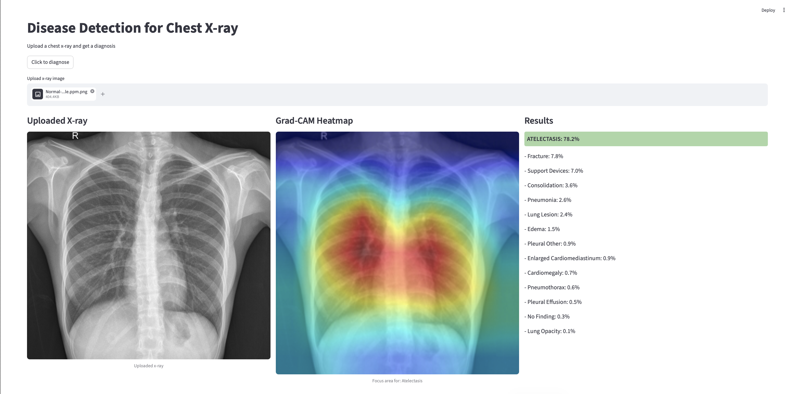

# Detect disease in chest X-rays images

Dette prosjektet er utviklet i **DAT255 – Deep Learning Engineering** og undersøker hvordan dyp læring kan brukes til å klassifisere flere patologier fra brystrøntgenbilder (multi-label classification).

---

## 👥 Prosjektgruppe

- Astrid I. Bensnes  
- Mannat Gabria  
- Amna Zafar  
- Sarah S. Ahsan  

---

## 📊 Datasett

Vi benytter en kuratert versjon av **CheXpert-datasettet** fra Kaggle.

- Multi-label klassifikasjon (14 klasser)  
- Ubalansert datasett  
- Inneholder usikre annotasjoner  

Datasettet er splittet i:
- Train (80%)  
- Validation (10%)  
- Test (10%)  

---

## 🧠 Modeller

Vi har eksperimentert med:

- Baseline CNN  
- ResNet18  
- DenseNet121  
- EfficientNet-B0  

---

## 📈 Resultater

| Modell           | Mean AUC | Macro F1 |
|------------------|---------|----------|
| Baseline CNN     | 0.6668  | 0.2790   |
| ResNet18         | 0.7752  | 0.3926   |
| DenseNet121      | ~0.78   | 0.4100   |
| EfficientNet-B0  | **0.7889** | ~0.40 |

👉 **EfficientNet-B0 oppnådde best total ytelse**, spesielt målt med ROC-AUC.

Observasjoner:
- Transfer learning gir betydelig bedre resultater  
- Enkelte klasser (f.eks. Pneumonia) er fortsatt utfordrende  
- Terskeloptimalisering forbedrer prediksjoner  

---

## 🔍 Forklarbarhet

Vi bruker **Grad-CAM** for å visualisere hvilke områder i bildet modellen fokuserer på.

| Atelectasis | Pneumonia |
|-----------------|----------|
|  |  |

---

## 🌐 Webapplikasjon

Vi har utviklet en webapplikasjon med **Streamlit** hvor brukeren kan:

- laste opp røntgenbilder  
- få prediksjoner for alle klasser  
- se sannsynligheter  
- visualisere Grad-CAM heatmaps
  
---
## 🎥 Demo

---

## 📁 Prosjektstruktur

- `app.py`  
  → Streamlit-applikasjon

- `models/`  
  → Lagrede modeller (.pth)

- `notebooks/`  
  → Trening og eksperimenter

- `outputs/`  
  → Figurer, plots og resultater

- `data/` *(valgfritt)*  
  → Datastruktur / CSV-filer

- `README.md`  
  → Prosjektbeskrivelse

- `requirements.txt`  
  → Avhengigheter

--- 
### ⚠️ Viktig

Kun for læring – ikke til medisinsk bruk!
