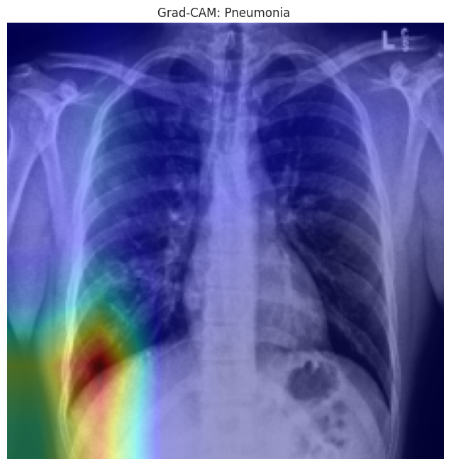

# Multi-Label Classification of Chest X-rays with Uncertainty Exploration

[](https://www.python.org/downloads/)
[](https://pytorch.org/)

Dette prosjektet utforsker bruk av dyplæring for automatisert diagnostisering av thorax-patologier fra røntgenbilder. Ved å kombinere moderne nevrale nettverk med forklarbarhet og usikkerhetsestimering, har vi utviklet et system som gir innsikt i AI-basert diagnostikk.

---

## 👥 Prosjektgruppe

- Astrid I. Bensnes  
- Mannat Gabria  
- Amna Zafar  
- Sarah S. Ahsan  

---

## 🌐 Webapplikasjon

For å demonstrere modellens praktiske anvendelse har vi utviklet en interaktiv webapplikasjon ved hjelp av **Streamlit**.

Applikasjonen lar brukeren:
- laste opp et bryst-røntgenbilde  
- motta prediksjoner for 14 sykdomsklasser  
- se sannsynligheter per klasse  
- visualisere modellens fokusområder med Grad-CAM  

Den ferdig trente modellen lastes fra en `.pth`-fil og brukes til sanntids inferens.

### 📸 Demo


---

## 📊 Datasett og Metodikk

### Datakilde (Kaggle)

Vi har benyttet en kuratert versjon av **CheXpert**-datasettet fra Kaggle (`ashery/chexpert`).

### Oppsplitting av data

Datasettet er splittet slik at ingen pasient-ID overlapper:

- **Treningssett (80%)**
- **Valideringssett (10%)**
- **Testsett (10%)**

---

## 🧠 Modellarkitektur

Vi har implementert og sammenlignet to tilnærminger:

1. **SimpleCNN (Baseline)**  
   - Egenutviklet modell  
   - Brukt til å utforske *Monte Carlo Dropout*  

2. **ResNet-18 (Hovedmodell)**  
   - Transfer learning fra ImageNet  
   - Multi-label klassifisering med `BCEWithLogitsLoss`  

---

## 📈 Resultater

| Metrikk                              | Verdi      |
|-------------------------------------|-----------|
| Gjennomsnittlig AUC (14 klasser)    | 0.7683    |
| Valideringstap                      | 0.2900    |
| Beste F1-score                      | 0.74      |
| Laveste F1-score                    | 0.13      |

### Analyse

- Sterk ytelse på tydelige patologier (f.eks. pleural effusion)  
- Lavere ytelse på diffuse tilstander (f.eks. pneumonia)  

---

## 🔍 Forklarbarhet og Pålitelighet

### Grad-CAM

Vi benytter Grad-CAM for å visualisere hvilke områder modellen fokuserer på.

| Pleural Effusion | Pneumonia |
|-----------------|----------|
|  |  |

---

### Usikkerhetsestimering (MC Dropout)

Vi utforsket Monte Carlo Dropout for å estimere modellens usikkerhet og redusere overkonfidente prediksjoner.

---

## 🛠 Installasjon og bruk

### 1. Klon repositoriet

```bash
git clone https://github.com/brukernavn/DAT255-Chest-Xray.git
cd DAT255-Chest-Xray
