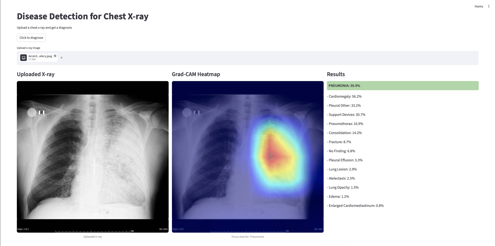
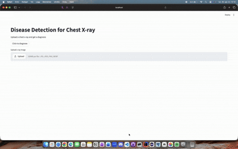

# Multi-Label Classification of Chest X-rays

Dette prosjektet er utviklet i **DAT255 – Deep Learning Engineering** og undersøker hvordan dyp læring kan brukes til å klassifisere flere patologier fra brystrøntgenbilder (multi-label classification).

---

## 👥 Prosjektgruppe

- Astrid I. Bensnes  
- Mannat Gabria  
- Amna Zafar  
- Sarah S. Ahsan  

---

## 📊 Datasett

Vi benytter en kuratert versjon av **CheXpert-datasettet** fra Kaggle.

- Multi-label klassifikasjon (14 klasser)  
- Ubalansert datasett  
- Inneholder usikre annotasjoner  

Datasettet er splittet i:
- Train (80%)  
- Validation (10%)  
- Test (10%)  

---

## 🧠 Modeller

Vi har eksperimentert med:

- Baseline CNN  
- ResNet18  
- DenseNet121  
- EfficientNet-B0  

---

## 📈 Resultater

| Modell           | Mean AUC | Macro F1 |
|------------------|---------|----------|
| Baseline CNN     | 0.6668  | 0.2790   |
| ResNet18         | 0.7752  | 0.3926   |
| DenseNet121      | ~0.78   | 0.4100   |
| EfficientNet-B0  | **0.7889** | ~0.40 |

👉 **EfficientNet-B0 oppnådde best total ytelse**, spesielt målt med ROC-AUC.

Observasjoner:
- Transfer learning gir betydelig bedre resultater  
- Enkelte klasser (f.eks. Pneumonia) er fortsatt utfordrende  
- Terskeloptimalisering forbedrer prediksjoner  

---

## 🔍 Forklarbarhet

Vi bruker **Grad-CAM** for å visualisere hvilke områder i bildet modellen fokuserer på.

| Pleural Effusion | Pneumonia |
|-----------------|----------|
|  |  |

---

## 🌐 Webapplikasjon

Vi har utviklet en webapplikasjon med **Streamlit** hvor brukeren kan:

- laste opp røntgenbilder  
- få prediksjoner for alle klasser  
- se sannsynligheter  
- visualisere Grad-CAM heatmaps

## 🎥 Demo

*(legg inn gif/video her)*



---

## 🛠 Kjør prosjektet

```bash
git clone https://github.com/brukernavn/DAT255-Chest-Xray.git
cd DAT255-Chest-Xray
pip install -r requirements.txt
streamlit run app.py
