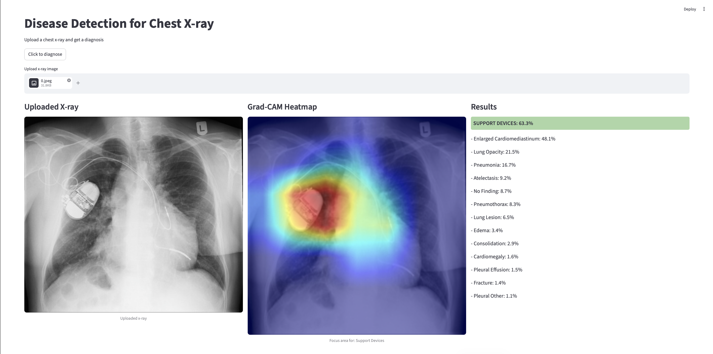
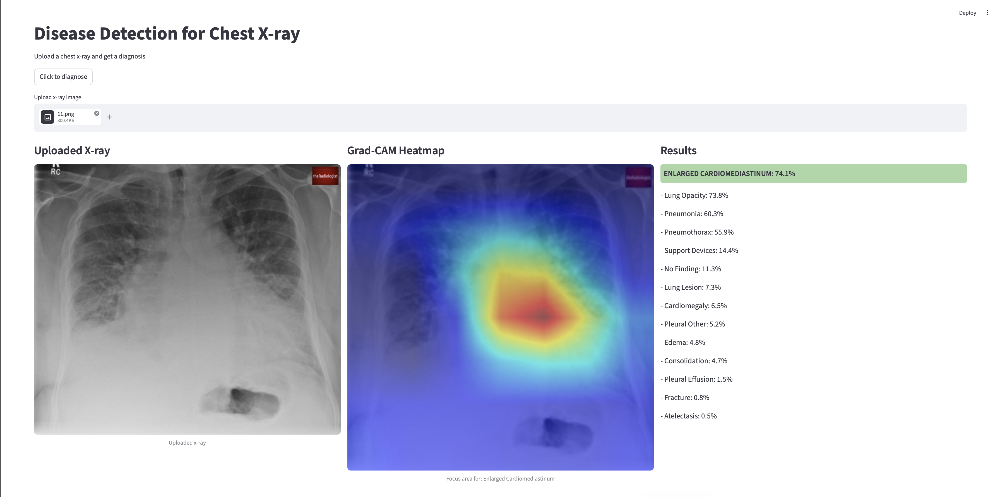

# Example X-rays from webpage

## Atelectasis

This X-ray shows signs of atelectasis.

## Pneumonia

This X-ray shows signs of pneumonia.

## Support Devices

This X-ray shows signs of support devices in the chest.

## Enlarged Cardiomediastinum

This X-ray shows signs of an enlarged cardiomediastinum
